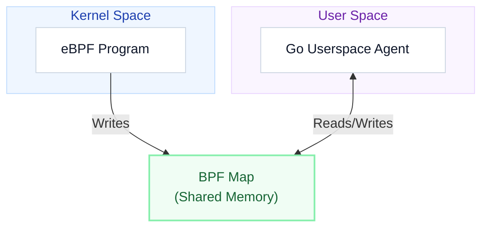

# Part 2: eBPF Architecture & Internals
## How Code Moves from Userspace to the Kernel Safely

<!--
Let's look under the hood. How does eBPF actually run code? How does the kernel guarantee safety? And how does an eBPF program, which is completely isolated in the kernel, talk to our userspace applications?
We will cover the compilation lifecycle, the Verifier, and Maps.
-->

---

# eBPF Compilation & Loading Lifecycle

<div class="text-slate-500 text-sm mt-1 mb-4 flex items-center gap-2">
  <span>How does C code execute securely inside the Linux Kernel?</span>
  <span class="bg-indigo-50 text-indigo-700 text-[10px] font-bold px-2 py-0.5 rounded-full border border-indigo-200">Execution Pipeline</span>
</div>

<div class="bg-slate-50/50 border border-slate-100 rounded-xl p-4 shadow-sm mb-4">


</div>

<div class="grid grid-cols-3 gap-6 text-xs mt-2">
<div class="card card-purple flex flex-col justify-between">
  <div>
    <div class="flex items-center gap-2 mb-1">
      <span class="text-purple-600 font-bold bg-purple-100/80 px-1.5 py-0.5 rounded">01</span>
      <p class="font-bold text-purple-950">Compile & Generate</p>
    </div>
    <p class="text-slate-600 leading-relaxed">Write kernel code in restricted C. Compile with Clang to generate BPF bytecode. <code>bpf2go</code> embeds the ELF inside Go.</p>
  </div>
</div>

<div class="card card-blue flex flex-col justify-between">
  <div>
    <div class="flex items-center gap-2 mb-1">
      <span class="text-blue-600 font-bold bg-blue-100/80 px-1.5 py-0.5 rounded">02</span>
      <p class="font-bold text-blue-950">Load & Verify</p>
    </div>
    <p class="text-slate-600 leading-relaxed">Go loader calls <code>bpf()</code> syscall. The kernel <strong>Verifier</strong> performs strict checks (no loops, no null pointers).</p>
  </div>
</div>

<div class="card card-green flex flex-col justify-between">
  <div>
    <div class="flex items-center gap-2 mb-1">
      <span class="text-green-600 font-bold bg-green-100/80 px-1.5 py-0.5 rounded">03</span>
      <p class="font-bold text-green-950">JIT & Attach</p>
    </div>
    <p class="text-slate-600 leading-relaxed">JIT compiler converts BPF to native CPU code, which attaches to hooks like <strong>XDP</strong>, <strong>kprobes</strong>, or <strong>syscalls</strong>.</p>
  </div>
</div>
</div>


<!--
This is the compilation and loading lifecycle.
1. Write the program in restricted C.
2. Compile it using Clang and LLVM into BPF bytecode (stored in an ELF file, usually with a `.o` extension).
3. The userspace loader (our Go program) makes the `bpf()` system call to pass the bytecode to the kernel.
4. Inside the kernel, the Verifier reads the bytecode and checks it for safety.
5. If verified, the JIT compiler translates BPF bytecode into host CPU native machine code.
6. The native code is attached to the target Hook point (like XDP, kprobes, or tracepoints).
-->

---

# The eBPF Verifier: Kernel Guardian

The **Verifier** is the core component that makes eBPF safe for production environments. It acts as an automated sandbox inspector.

<div class="grid grid-cols-2 gap-8 mt-4 text-sm">
<div>
<p class="font-bold mb-2">Strict Checks Performed</p>
<ul class="list-disc ml-4 space-y-1 text-slate-700">
  <li><strong>Termination</strong>: The program must have no infinite loops. It must terminate (finite paths).</li>
  <li><strong>Memory Safety</strong>: No out-of-bounds access. The program can only access memory it is explicitly permitted to read/write.</li>
  <li><strong>No Null Dereference</strong>: Every pointer lookup must be checked for <code>NULL</code> before use.</li>
  <li><strong>Size Limits</strong>: The program size must stay under the maximum allowed instruction count (typically 1 million instructions).</li>
</ul>
</div>
<div>

**Verifier Output Example**
If a program fails verification, the kernel rejects it entirely with a detailed log:

```text
0: (bf) r6 = r1
1: (85) call bpf_map_lookup_elem#1
...
10: (79) r2 = *(u64 *)(r0 +0)
R0 invalid mem access 'map_value_or_null'
# REJECTED! (forgot to check if r0 is NULL)
```

<div class="hl hl-orange mt-2">
The program will fail to load, protecting the host system from crashing!
</div>

</div>
</div>

<!--
The verifier is the reason why banks, databases, and cloud providers feel comfortable running third-party eBPF code on production machines.
It does static analysis on the bytecode instructions. It simulates every possible execution path.
If you try to dereference a map lookup pointer without checking if it's NULL first, the verifier will catch it and reject the entire program. It will print a register state dump like the one on the slide, showing exactly which instruction was illegal.
-->

---

# BPF Maps: State and Communication

eBPF programs are stateless by design and cannot directly invoke userspace APIs. They use **BPF Maps**—kernel-allocated key-value stores—to persist state and communicate.

<div class="grid grid-cols-2 gap-8 mt-4 text-sm">
<div>
<p class="font-bold mb-2">Key Map Properties</p>
<ul class="list-disc ml-4 space-y-1 text-slate-700">
  <li><strong>Shared Storage</strong>: Accessible by both kernel-space eBPF programs and userspace applications.</li>
  <li><strong>Asynchronous</strong>: Userspace can query or update map entries while the eBPF program runs.</li>
  <li><strong>Types of Maps</strong>:
    <ul class="list-circle ml-4 space-y-1">
      <li><code>BPF_MAP_TYPE_HASH</code> (Associative hash map)</li>
      <li><code>BPF_MAP_TYPE_ARRAY</code> (Fixed-size array)</li>
      <li><code>BPF_MAP_TYPE_RINGBUF</code> (High-performance lockless circular buffer for events)</li>
    </ul>
  </li>
</ul>
</div>
<div>

<div class="bg-slate-50/50 border border-slate-100 rounded-xl p-4 shadow-sm flex justify-center">



</div>

</div>
</div>

<!--
Because eBPF programs are sandboxed, they don't have standard file systems or network access. They can't do things like write to stdout or call a web API.
To share data, we use BPF Maps.
A BPF Map is a key-value store residing in kernel memory.
The eBPF program in the kernel can write to the map (e.g., incrementing a counter).
At the same time, our Go program in userspace can query the map using the `bpf()` syscall and display or react to that data.
-->
