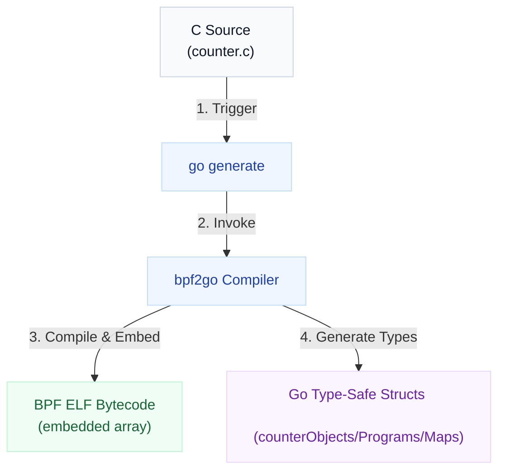

# Part 3: The Go & eBPF Synergy
## Why Go is the Premier Choice for eBPF Control Planes

<!--
Now we understand eBPF. Why write the userspace loader in Go? 
While eBPF programs in the kernel are written in restricted C, the loader and user agent can be written in any language that can invoke the `bpf()` syscall.
Go has emerged as the clear industry leader for this task. Let's see why.
-->

---

# Why Go for the Userspace Agent?

Writing the control plane in Go offers critical advantages for modern cloud infrastructure.

<div class="grid gap-8 mt-4" style="grid-template-columns: 2.5fr 1fr">
<div class="grid grid-cols-2 gap-6 text-sm">
<div>
<p class="font-bold text-slate-800">1. Cloud-Native Alignment</p>
<p class="text-xs text-slate-600 mt-1">Docker, K8s, and CNCF tools are written in Go. Integration is native and seamless.</p>

<p class="font-bold text-slate-800 mt-3">2. Concurrency (Goroutines)</p>
<p class="text-xs text-slate-600 mt-1">Lightweight goroutines handle streams of thousands of eBPF events per second concurrently.</p>
</div>
<div>
<p class="font-bold text-slate-800">3. Single Static Binaries</p>
<p class="text-xs text-slate-600 mt-1">No external runtime dependencies. Perfect for minimal container images and DaemonSets.</p>

<p class="font-bold text-slate-800 mt-3">4. Safety & Performance</p>
<p class="text-xs text-slate-600 mt-1">Type safety and garbage collection prevent leaks, achieving near-C execution speeds.</p>
</div>
</div>
<div class="flex flex-col items-center justify-center">
  
</div>
</div>

<!--
Go is the language of cloud native. Since almost everything in Kubernetes is Go, if you write your eBPF control plane in Go, you can import client-go, interact directly with the API server, export metrics to Prometheus, and build native microservices.
Also, Go compiles to a static binary. You don't need a Python runtime or a heavy JVM. Since eBPF is low-level, you want your agent to have a minimal footprint, which Go guarantees.
-->

---

# The Cilium `ebpf` Go Library

The `github.com/cilium/ebpf` repository is a pure-Go library that provides utility functions to load, edit, and write eBPF bytecode.

<div class="grid grid-cols-2 gap-8 mt-4 text-sm">
<div>
<p class="font-bold mb-2">Key Advantages</p>
<ul class="list-disc ml-4 space-y-1 text-slate-700">
  <li><strong>Pure Go</strong>: No CGO (C Go) compiler dependencies required for execution.</li>
  <li><strong>ELF Parsing</strong>: Natively parses the BPF ELF files generated by Clang.</li>
  <li><strong>CO-RE (Compile Once - Run Everywhere)</strong>: Built-in support to adapt BPF program structures to match varying target kernel versions automatically.</li>
  <li><strong>Robust Map API</strong>: Simple Go methods (<code>Lookup</code>, <code>Update</code>, <code>Put</code>, <code>Delete</code>) to read/write BPF maps.</li>
</ul>
</div>
<div>

<div class="hl hl-blue">
<strong>No CGO Required</strong><br>
Using CGO introduces compile-time complexity and slows down execution. The Cilium library interacts directly with the Linux kernel via <code>syscall.Syscall</code>.
</div>

<div class="hl hl-green mt-4">
<strong>Maintainer Support</strong><br>
Maintained by Cilium (the leading eBPF container networking project) and Cloudflare, ensuring production-tested support and API stability.
</div>

</div>
</div>

<!--
To make Go talk to eBPF, we use the Cilium ebpf library.
It is a pure Go implementation. Why is that important? Because libraries that rely on CGO are notoriously difficult to cross-compile and compile slowly. A pure Go library means we can cross-compile our Go agent for arm64 or amd64 easily.
The library handles parsing the ELF files, loading programs into the kernel, verifying them, and managing maps. It also supports CO-RE (Compile Once - Run Everywhere), meaning your eBPF bytecode can automatically adjust itself to run on different Linux kernel versions without needing to be recompiled.
-->

---

# The `bpf2go` Toolchain

`bpf2go` is a utility tool provided by the Cilium library that automates compiling C files and generating corresponding Go wrappers.

<div class="grid grid-cols-2 gap-8 mt-2 text-sm">
<div>

**How it fits in the workflow:**
1. You write your eBPF program in a C file (e.g., `counter.c`).
2. You add a Go generate directive to your Go source:
   ```go
   //go:generate go run github.com/cilium/ebpf/cmd/bpf2go counter counter.c
   ```
3. You run `go generate`.
4. `bpf2go` runs Clang to compile the C file, embeds the compiled ELF bytecode directly into generated Go files, and creates Go structures mapping the BPF maps and programs.

</div>
<div>

<div class="bg-slate-50/50 border border-slate-100 rounded-xl p-4 shadow-sm flex justify-center">



</div>

</div>
</div>

<!--
How do we bridge the gap between C bytecode and Go?
Cilium provides a tool called `bpf2go`.
In our Go file, we write a `//go:generate` directive. When we run `go generate`, the tool compiles our C code using Clang, compiles it to an ELF binary, and then *embeds* that binary directly as a byte array into a Go file.
It also generates type-safe Go structs like `counterObjects`, `counterPrograms`, and `counterMaps`. This means we don't have to manually load ELF files or do untyped map lookups; we get helper functions like `loadCounterObjects()` ready to use out-of-the-box.
-->
